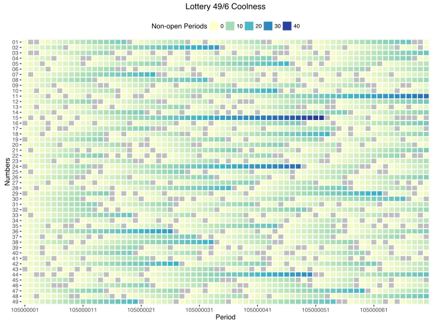
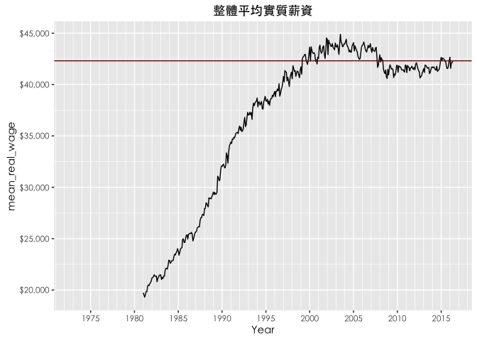
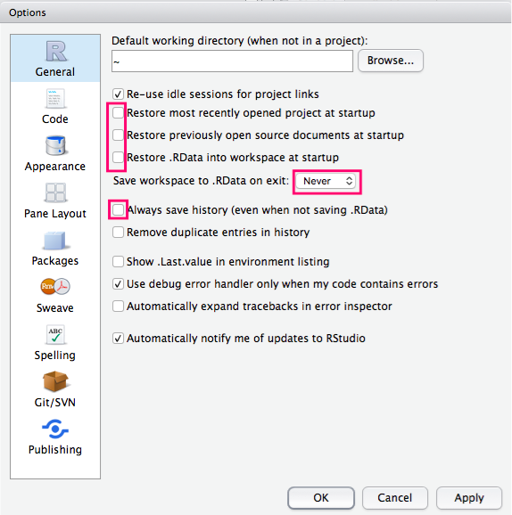
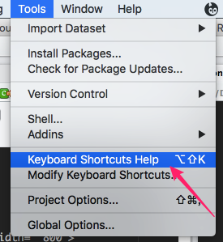

```{r setup, include=FALSE}
knitr::opts_chunk$set(
  echo = TRUE,
  eval = FALSE,
  message=FALSE, 
  warning=FALSE,
  comment = "#>"
)
```

## 安裝 R

課前環境準備(請依序都下載最新版本的並安裝)

+ Install R Language: [R](https://cran.rstudio.com/bin/windows/base/)
+ Install IDE(操作介面軟體安裝): [RStudio](https://www.rstudio.com/products/rstudio/download3/)
+ Install R Packages
  - Windows build pacakges need [Rtools](https://cran.r-project.org/bin/windows/Rtools/)

## 如何安裝套件

```{r, eval=FALSE}
install.packages("...")

# 載入套件
library(package)
```

(以下是課程所需套件安裝程式碼，將RStudio打開，在左下角的Console貼上下面程式碼)

```{r, eval=FALSE}
pkg_list <- c("tidyverse")
pkg_new <- pkg_list[!(pkg_list %in% installed.packages()[,"Package"])]
if(length(pkg_new)) install.packages(pkg_new)
rm(pkg_new, pkg_list)
```

---

## What R can do?

[](https://leoluyi.github.io/RViz_201609/example/lottery.html)

[](https://leoluyi.github.io/RViz_201609/example/salary.html)

---

## 先用R再學會R！

### 三步驟：

1. 打開 RStudio
2. 複製貼上
3. 執行  

<kbd>Ctrl</kbd>+<kbd>Enter</kbd>

### Hello RStudio


### RStudio Settings



</p>

### Must-known keyboard shortcuts

[All RStudio keyboard shortcuts](https://support.rstudio.com/hc/en-us/articles/200711853-Keyboard-Shortcuts)

<div style="font-size: 80%">
| Description      |  Windows & Linux      |     Mac                 |
|------------------|:---------------------:|:-----------------------:|
| Attempt completion / Indent | <kbd>Tab</kbd>     | <kbd>Tab</kbd>  |
| Run current line/selection  | <kbd>Ctrl</kbd>+<kbd>Enter</kbd> | <kbd>⌘</kbd>+<kbd>↩︎</kbd> |
| Comment/uncomment current line/selection | <kbd>Ctrl</kbd>+<kbd>Shift</kbd>+<kbd>C</kbd> | <kbd>⌘</kbd>+<kbd>⇧</kbd>+<kbd>C</kbd> |
| Reindent lines              | <kbd>Ctrl</kbd>+<kbd>I</kbd> | <kbd>⌘</kbd>+<kbd>I</kbd> |
| Insert pipe operator `%>%` | <kbd>Ctrl</kbd>+<kbd>Shift</kbd>+<kbd>M</kbd> | <kbd>⌘</kbd>+<kbd>⇧</kbd>+<kbd>M</kbd>
</div>



### 入門 R 的 5 大指令

<div>
1. tab: 多按 tab 
2. run: Ctrl + Enter (剛才已經學會了)
3. assign: `<-` or `=`
4. subsetting `$`, `[...]`, `[[...]]` 
5. pipe-line: `%>%`
</div>


---

## Arithmetic with R

In its most basic form, R can be used as a simple calculator. Consider the following arithmetic operators:

- Addition: `+`
- Subtraction: `-`
- Multiplication: `*`
- Division: `/`
- Exponentiation: `^`
- Modulo: `%%`

The last two might need some explaining:

- The `^` operator raises the number to its left to the power of the number to its right: for example `3^2` is 9.
- The modulo returns the remainder of the division of the number to the left by the number on its right, for example 5 modulo 3 or `5 %% 3` is 2.
With this knowledge, follow the instructions below to complete the exercise.

```{r}
# An addition
5 + 5 

# A subtraction
5 - 5 

# A multiplication
3 * 5

 # A division
(5 + 5) / 2 

# Exponentiation: Type 2^5 in the editor to calculate 2 to the power 5.

# Modulo: Type 28 %% 6 to calculate 28 modulo 6.

```

## Variable assignment

You can assign a value 4 to a variable my_var with the command

`my_var <- 4`

```{r, eval=FALSE}
# Assign the value 42 to x
x <- 

# Print out the value of the variable x
x
```


**Try:**

```{r}
# Assign to my_oranges the value 6.
my_apples <- 5

# Add the variables my_apples and my_oranges and have R simply print the result.


# Assign the result of adding my_apples and my_oranges to a new variable my_fruit.


```

## Basic data types in R

- Decimals values like 4.5 are called **numerics**.
- Natural numbers like 4 are called **integers**. Integers are also numerics.
- Boolean values (TRUE or FALSE) are called **logical**.
- Text (or string) values are called **characters**.

**Try:**

Change the value of the:

- `my_numeric` variable to `42`.
- `my_character` variable to `"universe"`. Note that the quotation marks indicate that `"universe"` is a character.
- `my_logical` variable to `FALSE`.
Note that R is case sensitive!
- Use `class(variable)` to show data type.

```{r}
# Change my_numeric to be 42
my_numeric <- 42.5

# Change my_character to be "universe"
my_character <- "some text"

# Change my_logical to be FALSE
my_logical <- TRUE
```

## Vectors

In R, you create a vector with the combine function c(). You place the vector elements separated by a comma between the parentheses. For example:

```{r}
numeric_vector <- c(1, 2, 3)
character_vector <- c("a", "b", "c")
```

**Try:**

```{r, eval=FALSE}
numeric_vector <- c(1, 10, 49)
character_vector <- c("a", "b", "c")

# Complete the code for boolean_vector
boolean_vector <-
```

After one week in Las Vegas and still zero Ferraris in your garage, you decide that it is time to start using your data analytical superpowers.

Before doing a first analysis, you decide to first collect all the winnings and losses for the last week:

For `poker_vector`:

- On Monday you won $140
- Tuesday you lost $50
- Wednesday you won $20
- Thursday you lost $120
- Friday you won $240

For `roulette_vector`:

- On Monday you lost $24
- Tuesday you lost $50
- Wednesday you won $100
- Thursday you lost $350
- Friday you won $10

You can give a name to the elements of a vector with the names() function. Have a look at this example:

```{r}
some_vector <- c("John Doe", "poker player")
names(some_vector) <- c("Name", "Profession")
```

**Try:**

```{r, eval=FALSE}
# Poker winnings from Monday to Friday
poker_vector <- c(140, -50, 20, -120, 240)

# Roulette winnings from Monday to Friday
roulette_vector <-  
  
# Assign days as names of poker_vector
names(poker_vector) <- c("Monday", "Tuesday", "Wednesday", "Thursday", "Friday")

# Assign days as names of roulette_vectors

```

## Vector selection

```{r}
poker_vector[c(1, 5)]
```

**Try:**

Assign the poker results of Tuesday, Wednesday and Thursday to the variable `poker_midweek`.

```{r, eval=FALSE}
# Poker and roulette winnings from Monday to Friday:
poker_vector <- c(140, -50, 20, -120, 240)
roulette_vector <- c(-24, -50, 100, -350, 10)
days_vector <- c("Monday", "Tuesday", "Wednesday", "Thursday", "Friday")
names(poker_vector) <- days_vector
names(roulette_vector) <- days_vector

# Define a new variable based on a selection
poker_midweek <- 
```

Selecting multiple elements of poker_vector with `c(2, 3, 4)` is not very convenient. Many statisticians are lazy people by nature, so they created an easier way to do this: `c(2, 3, 4)` can be abbreviated to `2:4`, which generates a vector with all natural numbers from 2 up to 4.

So, another way to find the mid-week results is `poker_vector[2:4]`. Notice how the vector `2:4` is placed between the square brackets to select element 2 up to 4.

## Data frames

What is a data.frame?

```{r}
data(iris) # load the data
View(iris) # view in the pane
head(iris) # check first 5 rows
tail(iris) # check last 5 rows
str(iris) # look at data structure
```

Subsetting

```{r}
iris[5:10, 2:3]
iris[, 2:3]
iris[5:10, ]
```

## `{dplyr}`: R 資料處理兵器

- `select()`: 挑選你要的欄位變數.
- `filter()`: 提供如 SQL where 的語法.條件選取
- `group_by()`: 須分群的變數（類別，時間…）
- `summarise()`: aggregation/summarise 函數
- `arrange()`： 排序資料
- `join()`： 合併兩個相同 key 值的資料表
- mutate()： 變化出新的欄位

```{r, eval=TRUE}
library(dplyr)
library(magrittr)

iris <- as_data_frame(iris)

# select(): 我只關心下面欄位…
iris %>% select(Sepal.Length)
iris %>% select(Petal.Width)

# filter(): 篩選特定條件
iris %>% filter(Sepal.Length > 6.5) # Sepal.Length 大於 6.5

# arrange(): 根據某欄位的大小排序
iris %>% arrange(Petal.Length)
iris %>% arrange(desc(Petal.Length))
```

## How to load csv into data.frame

```{r, eval=FALSE}
library(readr)
my_data <- read_csv("file_path.csv")
```

## Summary Statistics

```{r}
summary(iris)
```


## Assignment

1. Check this video: https://www.youtube.com/watch?v=0xVqLJe9_CY&feature=youtu.be
2. Load the [Pokemon data](data/pokemons.csv) into `data.frame`
3. Find the heaviest one of 151 pokemons
4. How many pokemons of which `Type1` are `"FIRE"`
5. Find the pokemon of which `Type1` are `"POISON"` and has the largest `BaseAttack` value

```{r, echo=FALSE, eval=TRUE, message=FALSE, warning=FALSE}
library(readr)
pokemon <- read_csv("data/pokemons.csv")
print(pokemon)
```

